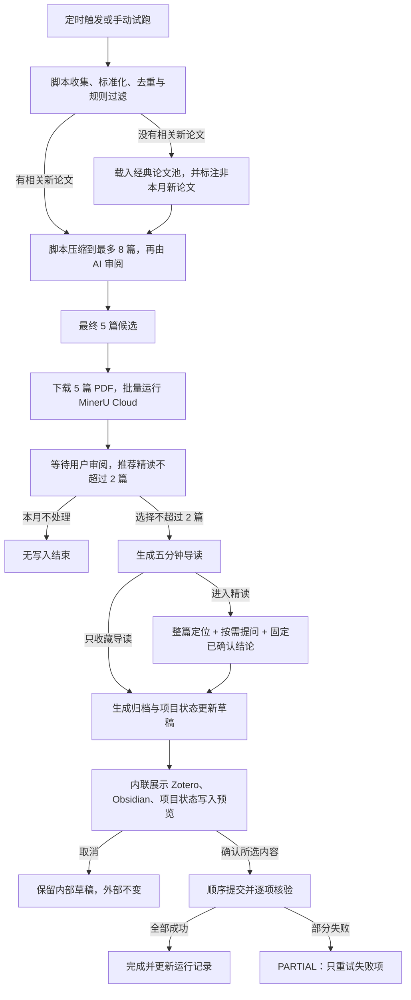

# Pi Agent V1 产品规格：期刊追踪与精读

> 状态：可靠性与联合归档基线
> 日期：2026-07-27
> 目标：用一个真实、可恢复、可审阅的周期工作流验证 Pi Agent 的产品定位。

## 1. 产品结论

Pi Agent 是一个**以长期项目为中心的个人工作流播放器**。

- 项目是用户长期维护的主体，保存目标、历史决定、开放问题和下一步。
- 工作流是反复推进项目的方法。
- Run 是工作流的一次实际执行。
- 对话是用户在 Run 中追问、修正和确认的界面。
- Skill 提供某一步的方法，工具或脚本执行具体动作。
- Codex 负责创造、修改和修复工作流；Pi Agent 负责稳定、低成本地重复运行已经验证的方法。

一句话边界：

> 外部是项目中心的产品，内部是工作流驱动的运行引擎。

V1 只证明一件事：一次周期运行可以用有限的模型调用找到值得读的论文，在人工控制下形成有引用的长期成果，并安全地推动项目状态前进。

## 2. V1 不做什么

- 不做通用工作流市场或 Skill 市场。
- 不做可视化 DAG 编辑器或通用工作流 DSL。
- 不做多 Agent 角色团队。
- 不做自动多模型路由；先用一个强模型建立质量与成本基线。
- 不做向量数据库、知识图谱或复杂自动记忆。
- 不做 Zotero、Obsidian、项目文件之间的双向同步。
- 不做跨系统事务回滚；采用可恢复的顺序提交。
- 不做多用户、组织权限和审批流。
- 不在右栏放常驻确认队列。
- 不把 MinerU 解析等同于精读：最终 5 篇候选都可预解析，但用户仍只选择最多 2 篇按需精读。

## 3. 首个工作流边界

### 3.1 工作流名称

`期刊追踪与精读`

### 3.2 默认监测范围

期刊：

- Artificial Intelligence（AI）
- IEEE Transactions on Pattern Analysis and Machine Intelligence（TPAMI）
- International Journal of Computer Vision（IJCV）
- Journal of Machine Learning Research（JMLR）

会议：

- AAAI
- NeurIPS
- ACL
- CVPR
- ICCV
- ICML
- ICLR

期刊按周检查增量；会议按论文集、录用列表、奖项或公开批次更新。来源优先级为官方论文集、官方期刊页、OpenReview、ACL Anthology、CVF、PMLR 等；DBLP 用于书目信息索引，不单独作为全文来源。

### 3.3 默认主题

- LLM Agent
- 规划与工具使用
- 记忆与上下文工程
- RAG 与知识工作流
- 人机协作与人工确认
- Agent 评估、可靠性与可追溯性

视觉论文来源仍会监测，但只有和项目或上述主题有关时才进入重点推荐。

### 3.4 输入与产物

输入：

- 已绑定项目目录中的项目状态文件和相关局部文件。
- 来源注册表、RSS、官方列表、上次扫描游标和历史候选。
- 用户临时上传或粘贴的补充材料。
- 用户在精读过程中的问题、修正和选择。

正式产物分三层：

| 内容 | 唯一事实源 | 其他位置只保存 |
| --- | --- | --- |
| 题录、PDF、五分钟导读 | Zotero | DOI、规范链接或条目 ID |
| 完整且可持续补充的精读笔记 | Obsidian | Zotero 中的笔记链接 |
| 对项目的已确认影响 | 项目状态 Markdown | 论文引用和 Obsidian 链接 |
| 游标、草稿、运行记录、缓存 | Pi Agent Run Store | 不作为长期知识事实源 |

删除 Pi Agent 的运行缓存后，三个正式成果仍应可以独立阅读。

## 4. 端到端流程



### 4.1 脚本初筛

脚本负责：

1. 按来源读取增量并保存 `cursor_before`。
2. 标准化标题、作者、日期、venue、DOI、OpenReview ID、arXiv ID 和 URL。
3. 依次用 DOI、官方 ID、arXiv ID、规范化标题加年份去重。
4. 排除社论、目录、征稿、勘误等非目标类型。
5. 执行六类主题规则过滤。
6. 收集可核验的热度信号及其来源。
7. 先按主题、公开 PDF、证据完整度和来源信号确定性压缩到最多 8 篇，再供 AI 语义审阅。

`published_at`、`issue_date` 和 `first_seen_at` 必须分开保存。来源失败时先分类为网络、访问保护、解析或数据质量问题，不因一次失败修改解析规则，也不前移该来源游标。

候选列表必须把“本月新发表”和“本月补发现的历史论文”分开，避免把刚被系统发现误写成刚发表。来源健康不仅检查能否抓到一条记录，还要检查新鲜度、关键字段完整度和已知样例。脚本先生成 `next_cursor`；只有扫描结果和候选已经可靠落盘后，才用临时文件加原子替换推进游标。

### 4.2 AI 推荐

AI 只读取脚本给出的标题、摘要、热度证据，以及项目状态中的相关片段。

- 输出最多 5 篇重点候选。
- 默认推荐最多 2 篇：一篇直接推进当前项目，一篇拓展前沿视野。
- 每篇必须解释“为什么值得读”“热度依据是什么”“与项目有什么关系”。
- 热度只能解释脚本已收集的证据，不能由模型编造。
- 摘要只能支持候选判断，不能被写成已经全文验证的论文结论。

### 4.3 MinerU 预解析与五分钟导读

AI 选出最终 5 篇后，Pi Agent 就把可取得的 PDF 放入自己的临时运行目录，并用一个批次提交 MinerU Cloud。这样可以利用每日免费额度提前准备全文，同时不增加模型 Token。经典兜底论文与本月新论文执行同一预解析流程，但界面必须始终保留其“非本月新论文”标记。

用户随后仍只选择最多 2 篇进入五分钟导读和按需精读。MinerU 额度耗尽、单篇 PDF 缺失或部分解析失败不能隐藏：运行保留逐篇状态，并允许稍后继续或重试；没有全文证据的论文不得进入完整精读结论。

五分钟导读 v2 是论文中立的固定合同：只输入当前论文的有限正文块，不输入项目上下文。输出至少包含：

- 这篇论文试图解决什么问题。
- 为什么现在值得读。
- 方法的核心直觉。
- 作者提供了什么主要证据。
- 已知局限或尚待全文确认的部分。
- 进入精读时最值得追问的 2 至 3 个问题。
- 1 至 8 个真实、唯一且已校验的正文 `block_id` 引用；没有可靠映射时不得编造页码或章节。

“对项目的作用”继续作为独立的候选阶段判断显示，并明确标注其只依据题录与摘要。无法取得并解析全文时不生成 v2 导读：保留逐篇失败状态并允许重试，不以摘要级结果冒充全文导读。

### 4.4 导读后的按需精读

精读采用“整篇定位 → 按需教学”，不强迫用户依次完成四个可见阶段：

1. 打开论文先展示问题、技术路线、最值得读的 2–3 处和需要保持怀疑的位置。
2. 用户可打开任意顶层章节、选择任意正文片段或直接提问；选文只加入 composer 引用，不自动调用模型。
3. Agent 回答绑定稳定 block/offset 引用，原文与解释分开；没有可靠页码映射时只显示章节和段落锚点。
4. 用户可以把已经核对的回答结论固定为 `PinnedConclusion`。它记录来源 turn、引用、确认人和状态，不要求每节都写笔记。
5. 同一论文只有一个 canonical reading 可以归档；从 checkpoint 建立的 scratch branch 可自由探索，但必须先显式 promote 才能生成归档预览。

研究问题、方法机制、实验证据和项目关系仍是归档时的四类证据覆盖合同。归档综合以已确认的 pinned conclusions 为主，只对缺口补充结构化证据；它们不再是导航、进度条或阅读顺序门禁。

十轮引导使用稳定 `round_id` 对齐刷新后的回答进度。旧的内部字段、`待核验` 和无效短答继续保留审计记录，但不进入正常阅读流或后续模型上下文。用户修正后的理解优先于未确认的模型草稿。

每篇论文最终只形成一篇可持续补充的 Obsidian 主笔记；周报只负责索引和串联。

### 4.5 写入草稿与提交

阅读过程中的原始论文、解析正文、导读和笔记都先留在 Pi Agent 的 Run Store。V1 在本轮处理结束时生成一个 `ArchiveBatch` 预览，以保留一次批量确认：

- Zotero：只为用户明确选择“收藏”或“精读”的论文生成提案；目标 collection、题录、附件、五分钟导读和拟执行动作必须逐篇可见。仅被 MinerU 预解析但未被选择的候选不进入 Zotero。V1 只自动创建新条目；若查到已有同一论文条目，则该篇显示为不可勾选的“需要手工处理”，不自动移动 collection，也不修改既有 PDF 或笔记。
- Obsidian：目标文件、写入方式、位置、标题、要点、引用、是否修改原文。
- 项目状态：目标文件和逐项 diff；仅包含用户选中的结论、决定、开放问题和下一步。

用户可以取消任意单项，然后点击一次“确认写入所选内容”。“选择论文”“开始精读”“可以”均不构成写入授权。

提交依赖顺序为：

1. Obsidian canonical note；
2. Zotero 题录、原始论文、导读和 Obsidian 链接；
3. `project_state.md` 中已经确认的项目影响。

开始提交前一次性重校验全部选中项的目标版本和内容 hash。每一步使用 durable ledger、幂等键和读回验证记录外部 ID、目标版本与结果；部分失败时不删除已经成功的内容，不伪装跨系统回滚，只重试失败项。已有 Zotero 条目保持不可执行的 `manual_update_required`，整批不能标记为完全归档。

## 5. 状态机

### 5.1 持久状态

| 状态 | 含义 | 允许的下一步 |
| --- | --- | --- |
| `SCHEDULED` | 已创建周期运行 | `PREPARING`、`CANCELLED` |
| `PREPARING` | 脚本扫描或 AI 初筛中 | `PREPARING_DOCUMENTS`、`NO_UPDATES`、`FAILED` |
| `PREPARING_DOCUMENTS` | 下载 PDF 并准备 MinerU 全文 | `REVIEW_READY`、`FAILED` |
| `REVIEW_READY` | 候选等待用户选择 | `PREPARING_GUIDES`、`COMPLETED_NO_WRITE` |
| `PREPARING_GUIDES` | 为用户所选 1 至 2 篇生成导读 | `GUIDE_READY`、`REVIEW_READY`、`FAILED` |
| `GUIDE_READY` | 等待用户决定是否精读 | `READING`、`DRAFT_READY`、`CANCELLED` |
| `READING` | 按需精读，可跨会话暂停或建立 scratch branch | `READING`、`DRAFT_READY`、`CANCELLED` |
| `DRAFT_READY` | 正在生成写入草稿 | `AWAITING_APPROVAL`、`FAILED` |
| `AWAITING_APPROVAL` | 精确预览等待确认 | `COMMITTING`、`CANCELLED` |
| `COMMITTING` | 顺序执行已批准写入 | `COMPLETED`、`PARTIAL` |
| `PARTIAL` | 只有部分目标写入成功 | `COMMITTING`、`CANCELLED` |
| `COMPLETED` | 所选写入已核验 | 终态 |
| `COMPLETED_NO_WRITE` | 无候选或用户本月跳过 | 终态 |
| `FAILED` | 当前步骤失败且尚未发生部分外部写入 | 重试当前步骤、`CANCELLED` |
| `CANCELLED` | 用户主动结束 | 终态 |

等待用户时状态仍保持原阶段，另用 `paused_reason` 表示等待选择、追问或确认，不额外制造大量状态。

### 5.2 调度规则

- 上一个 Run 未结束时，新定时触发不得覆盖它。
- V1 直接跳过新触发并记录原因，不前移扫描游标。
- `NO_UPDATES` 时模型调用数必须为零。
- 用户一篇都不选时仍正常结束，并保留已成功来源的游标。
- 重新启动应用后，从最后一个持久状态恢复，不重跑已成功步骤。

## 6. 责任边界

| 主体 | 负责 | 不负责 |
| --- | --- | --- |
| 脚本 | 收集、游标、标准化、去重、规则过滤、热度证据、下载、校验、确定性写入 | 语义相关性、论文价值判断 |
| AI | 语义初筛、推荐理由、导读、按需精读、项目影响草稿 | 游标、去重、权限、目标路径、真实写入 |
| 用户 | 选择论文、追问修正、决定是否精读、选择写入项、最终批准 | 手工搬运中间文件 |
| Pi Agent | 恢复状态、编排步骤、控制权限、展示证据、记录运行、失败恢复 | 自动扩大任务范围或绕过确认 |

## 7. 界面规格

沿用共享三栏外壳：`论文项目/会话 → Agent → 当前工件`。

### 左栏：项目与论文会话

- 项目仍是一级对象。
- `每月追踪`固定在论文研读分组上方，始终进入候选页；恢复 Run 不自动打开首篇论文。
- 只有用户明确选择 `read` 的论文进入论文研读分组；同一稳定论文身份跨 Run 去重，同时保留来源 Run provenance。
- 状态只显示可行动的信息，例如“本月待审阅”“正文准备失败，可重试”“等待归档确认”。
- V1 不提供创建或编辑通用工作流的入口。

### 中栏：Agent

中栏始终保持论文 Agent 可用：展示导读后的定位、用户问题、引用绑定回答和已确认结论。打开原文、切换右侧工件、恢复会话或改变阅读深度都不能自动调用模型；只有显式发送才产生 turn。

### 右栏：当前论文工件

- 右栏默认关闭，可切换当前段落、完整原文、五分钟导读、阅读笔记、项目上下文和归档预览，不重置中栏对话。
- 原文呈现连续结构、公式、图表与表格；选择文本只生成一个可移除引用，不出现浮动 AI 菜单。
- 写入预览和唯一确认按钮必须共置在右侧 `ArchiveBatch` 工件，展示精确 diff/hash、依赖、逐项选择和失败恢复；不放全局待确认队列。

### 默认折叠层级

用户默认只看到一个完整的“期刊追踪与精读”流程。候选论文先显示标题、作者和推荐层级，再用“论文讲什么”展示约 50–80 个中文字符的选择摘要，用“对项目的作用”解释当前项目相关性；不要直接塞入原始长摘要。热度与证据范围按需展开，且同时最多展开一篇。脚本、工具、Skill、模型调用和重试细节收在“运行详情”中，需要时再展开。

## 8. 最小数据契约

V1 的工作流结构固定在代码中，不先抽象通用 DSL。

### 8.1 项目绑定

```text
project_id
project_name
project_root
project_state_path
obsidian_note_directory
zotero_collection_id
sources[]
topics[]
schedule + timezone
model_id
candidate_limit = 20
focus_limit = 5
guide_limit = 2
reading_limit = 2
```

项目绑定必须分别展示：允许读取的本地范围、会发送给远程模型的内容范围、三个正式写入目标。允许读取项目文件不等于允许上传整个项目目录。

### 8.2 论文候选

```text
paper_id
dedupe_key
title
authors[]
venue
paper_type
published_at
issue_date
first_seen_at
observed_at
doi
canonical_url
official_url
pdf_url
discovery_url
link_status
abstract
source_id
heat_signals[]
topic_matches[]
relevance_reason
evidence_scope
raw_metadata
```

### 8.3 Run

```text
run_id
project_id
workflow_id
workflow_version
window_start
window_end
status
current_stage
paused_reason
cursor_before
cursor_after
candidate_ids[]
focused_ids[]
selected_ids[]
token_usage[]
started_at
updated_at
last_error
```

所有时间窗口和日期截断都显式使用项目时区，不能依赖 UTC 字符串截断。

### 8.4 写入提案

```text
proposal_id
run_id
paper_id
target: zotero | obsidian | project_state
operation: create | update
target_locator
preview_or_diff
content_hash
target_version_or_hash
selected
status: draft | approved | committed | failed
external_id
verification_result
```

批准记录必须绑定所选提案 ID、全部内容哈希和目标当前版本。预览内容或目标在确认后发生变化时，原批准失效，必须重新生成预览。

## 9. 本地存储与架构

### 9.1 V1 目标架构

```text
React 界面
  ↕ 本地 API / 事件流
本地 Node.js 服务
  ├─ 固定的期刊追踪工作流运行器
  ├─ Pi 风格的轻量模型适配层
  ├─ 来源扫描与去重脚本
  ├─ MinerU 适配器
  ├─ Zotero 适配器
  ├─ Obsidian / 项目文件适配器
  └─ Run Store 与权限控制
```

- 不在浏览器中保存模型密钥，也不让浏览器直接操作本地文件。
- 轻量模型适配层只负责单步、结构化、可审计的模型调用；确定性脚本负责工具动作，本地服务控制工作流状态、权限和正式写入。V1 不嵌入完整的通用编码 Agent 运行时。
- V1 可先使用每个 Run 一个目录的 JSON/Markdown/JSONL 存储，不必立即引入数据库。未来 SQLite 只做索引、缓存和运行历史，不能取代正式 Markdown。
- 所有路径必须经过根目录约束和解析后的路径校验。
- Artifact 使用稳定 `artifact_id` 和相对路径，不用文件 basename 作为唯一键。
- 运行清单、批准记录和外部写入结果长期保留；PDF、MinerU 图片和其他大文件缓存使用可配置保留期并可安全清理。

建议的内部 Run 目录：

```text
<app-data>/runs/<run-id>/
  run.json
  inputs/candidates.json
  extraction/<paper-id>/paper.md
  guides/<paper-id>.md
  readings/<paper-id>/<stage>.md
  proposals/*.json
  events.jsonl
```

### 9.2 可复用的本地先例

`/Users/yuzhou4tc/Public/工作坊/journal-workshop-prototype` 已有以下可借鉴内容：

- 来源注册表、稳定 fallback、首次发现游标和累计去重模型。
- 网络、访问保护、解析、数据质量四类来源故障分类。
- `job → node → artifact` 的本地运行记录结构。
- MinerU Cloud v4 批次提交、进度事件、部分失败、额度延后、结果包路径安全检查和本地结果缓存。
- 节点产物落 Markdown/JSON、失败节点可定位的做法。

优先抽取一个小型 TypeScript `monitor-core` 及纯函数测试，复用论文身份、日期、去重、首次发现和字段质量保护等合同；不要整体搬运旧项目已经过大的抓取脚本。

不要直接搬入：公众号成稿提示词、Word 导出、多用户 RBAC、Vercel/FastAPI 部署、微信草稿和该项目的全部 22 个经济期刊适配器。Pi Agent 首版只提取通用合同，避免把另一个产品的复杂度一起继承。

## 10. 权限与安全

无需每次确认：

- 读取用户已经绑定的项目目录。
- 读取已经配置的公开来源。
- 写入 Pi Agent 自身的缓存、运行记录和临时目录。
- 生成候选、导读、精读和项目更新草稿。

必须精确预览并确认：

- 创建 Zotero 条目、附件和笔记；已有条目的移动或更新仍由用户在 Zotero 中手工处理。
- 创建、追加或修改 Obsidian 笔记。
- 修改项目状态文件或项目中的任何正式文件。
- 覆盖已有内容。

安全要求：

- 只向模型发送完成当前步骤所需的项目片段。
- 不把整个项目目录默认上传给远程模型。
- 不绕过登录页、验证码、WAF 或付费访问。
- 临时下载与 MinerU 结果可清理，正式产物不可依赖临时路径。
- Zotero 写入前按操作标识、DOI 和规范化标题查重，禁止重复创建；预览与真正提交之间再次查重。
- Obsidian 和项目文件写入前校验预览时的文件哈希。

## 11. 失败恢复

- 单个来源失败：其他来源继续，失败来源游标不前移。
- 单条元数据损坏：放入隔离列表，不让整个 Run 失败。
- PDF 无法取得并解析：不生成 v2 导读，保留逐篇失败状态并允许重试。
- MinerU 失败：保留 PDF 和失败信息，允许重试，不生成完整精读结论。
- 模型超时：复用脚本结果和输入哈希，不重新抓取。
- 应用退出：从最后持久状态和具体精读阶段恢复。
- 预览后目标变化：停止提交，重新生成预览。
- Zotero 单篇成功而同批其他论文失败或被已有条目阻止：进入 `PARTIAL`，只重试可安全重试且尚未成功的目标。
- 用户取消：保留内部草稿和缓存，三个正式目标不变。

V1 不做跨系统自动回滚。顺序提交日志、稳定幂等键和逐项核验足以支持安全恢复。

## 12. Token 控制

- 收集、游标、去重、规则过滤和基本热度信号使用 0 Token。
- 初筛一次最多提交 8 篇，每篇摘要最多 500 字符；候选池压缩本身不使用模型。
- UI 最多展示 5 篇重点候选。
- 默认最多生成 2 篇导读，最多精读 2 篇。
- 最终 5 篇候选都尝试下载 PDF 和运行 MinerU；这一步不调用语言模型。
- 精读阶段按章节检索，不重复发送全文。
- 项目上下文只发送项目状态和相关局部片段。
- 相同模型、提示词与输入哈希可命中缓存。
- 不允许无限 Agent 循环或自动扩展研究范围。

每一步至少记录：

```text
step_name
model_id
prompt_tokens
cached_tokens
completion_tokens
estimated_cost
```

先用一个强模型采集质量和成本基线，再决定哪些步骤可以降级或改为本地模型。

## 13. 验收标准

### 13.1 产品闭环

- 能从“本月待审阅”进入候选列表。
- 能查看候选来源、日期、热度证据、项目相关性和证据范围。
- 最多选择两篇，并且每篇先看到五分钟导读。
- 用户可以停在导读，也可以进入按需精读；四个阅读镜头只在归档综合时检查覆盖率。
- 精读可以跨会话恢复，追问和修正不会丢失。
- 最终能查看 Zotero、Obsidian、项目状态三组精确预览。
- 可以逐项取消，并一次确认所选写入。
- 未明确确认时，三个正式目标均保持不变。
- 正式成果带可核验引用，并且不依赖 Pi Agent 数据库才能阅读。

### 13.2 确定性与恢复

- 同一论文从多个来源出现时只生成一个候选。
- 相同输入重复运行时，脚本过滤结果一致。
- 本月新发表与本月补发现的历史论文分栏正确，界面不混淆两个日期。
- 没有相关新论文时改用稳定经典池，并在模型初筛与界面中明确标注“非本月新论文”。
- AI 只能引用脚本提供的热度证据。
- 最终进入候选的 5 篇都尝试运行 MinerU，逐篇结果和失败原因可见。
- 预览后文件被外部修改时，提交必须被阻止。
- 模拟 Obsidian 写入失败后，重试不会重复创建 Zotero 条目。
- 重试操作必须真正从失败节点继续执行，而不只是生成一份“将要重试”的计划。
- 中途失败不能推进未成功来源的游标，应用重启后也不能丢失已经落盘的候选。
- 上次 Run 未完成时，新周期触发不会覆盖旧 Run 或错误前移游标。
- Token 使用可以按 Run 和步骤查看。

## 14. 当前实现（2026-07-27）

- Run Store 使用单调事件序号、snapshot watermark、run-owned staging 和 cursor CAS。应用运行期间按周准点调度，下次启动会补跑错过周期；当前不安装永久 LaunchAgent。
- 4 个期刊与 7 个会议均有声明的官方 primary adapter；Crossref/DBLP 只作为明确 fallback。日期精度、来源失败、adapter route 和 provenance 均持久化。
- 扫描、ranking、候选落盘与 cursor 提交可以从最后稳定阶段恢复；付费语义步骤使用输入 hash 缓存和 in-flight 去重。
- 五篇正文有限并发准备，逐篇保存下载、上传、额度、解析与重试状态。成功项不会因其他论文失败而重跑。
- 导读、连续原文、稳定引用、按需 Agent 提问、十轮 `round_id`、PinnedConclusion、canonical/scratch reading branch 与 promotion 已接入持久状态。
- Live 模式默认 fail closed；只有测试或显式开发配置可以启用 fixture。缺少 `project_state.md`、扫描失败或恢复中不会静默显示示例候选。
- Obsidian、Zotero 与 `project_state.md` 已统一进入 ArchiveBatch。预览绑定内容和目标 hash；提交使用依赖顺序、durable ledger、幂等键、读回验证与失败项恢复。
- Paper Agent 的单条 Obsidian 补充仍是独立、哈希绑定的窄写入，不改变 Run phase 或 canonical workflow 区。
- 本次开发用临时目录和测试连接器核验写入/恢复合同，没有对用户的真实 Zotero、Obsidian 或项目状态数据执行生产写入。

## 15. 进入实现前只剩的配置项

- 首个真实项目目录和项目状态文件路径。
- Obsidian 精读笔记目录。
- Zotero 目标 collection。
- 每月准备时间与时区。
- 首次基线使用的模型。
- MinerU Cloud API Token。

这些是项目绑定配置，不改变本规格的产品结构。
